# Diagramas UML — HoneyBalance
## Todos los diagramas en código Mermaid listos para pegar en https://mermaid.live

---

## DIAGRAMA 1 — Clases: Dominio del Backend (Modelo de Datos)

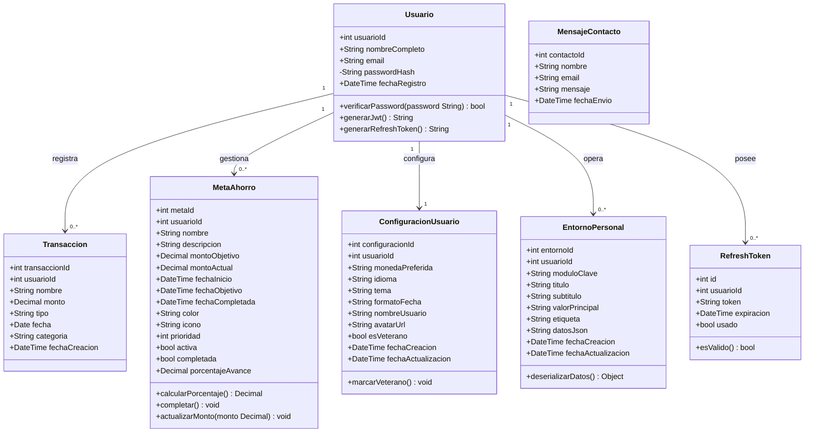

---

## DIAGRAMA 2 — Clases: Capa de Servicios (Frontend Angular)

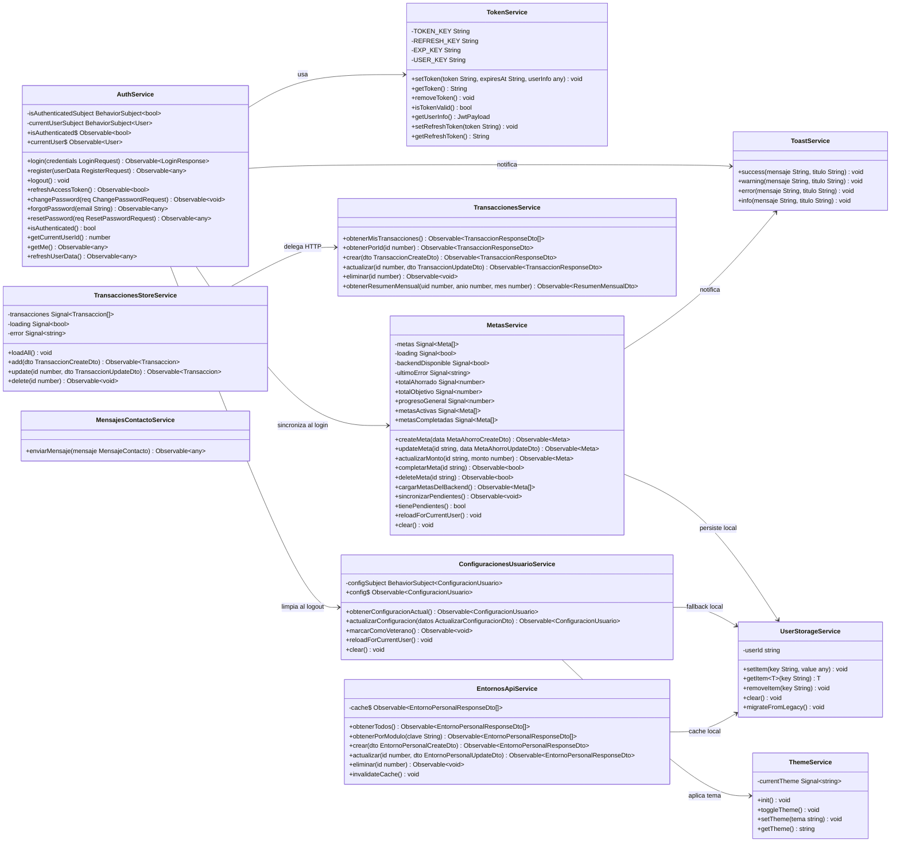

---

## DIAGRAMA 3 — Clases: DTOs de la API REST

```mermaid
classDiagram
    direction TB

    class LoginRequest {
        +String email
        +String password
    }

    class LoginResponse {
        +String token
        +String expiresAt
        +String refreshToken
        +UsuarioInfo usuario
    }

    class UsuarioInfo {
        +int usuarioId
        +String nombreCompleto
        +String email
        +String fechaRegistro
    }

    class RegisterRequest {
        +String nombreCompleto
        +String email
        +String password
    }

    class ChangePasswordRequest {
        +String passwordActual
        +String passwordNueva
    }

    class ForgotPasswordRequest {
        +String email
    }

    class ResetPasswordRequest {
        +String token
        +String newPassword
    }

    class TransaccionCreateDto {
        +String nombre
        +Decimal monto
        +String tipo
        +String fecha
        +String categoria
        +int usuarioId
    }

    class TransaccionUpdateDto {
        +String nombre
        +Decimal monto
        +String tipo
        +String fecha
        +String categoria
    }

    class TransaccionResponseDto {
        +int transaccionId
        +int usuarioId
        +String nombre
        +Decimal monto
        +String tipo
        +String fecha
        +String categoria
        +String fechaCreacion
    }

    class MetaAhorroCreateDto {
        +String nombre
        +String descripcion
        +Decimal montoObjetivo
        +Decimal montoActual
        +int usuarioId
        +String fechaObjetivo
        +String color
        +String icono
        +int prioridad
    }

    class MetaAhorroUpdateDto {
        +String nombre
        +Decimal montoObjetivo
        +Decimal montoActual
        +String fechaObjetivo
        +String color
        +String icono
        +int prioridad
        +bool activa
        +bool completada
    }

    class MetaAhorroResponseDto {
        +int metaId
        +int usuarioId
        +String nombre
        +Decimal montoObjetivo
        +Decimal montoActual
        +String fechaInicio
        +String fechaObjetivo
        +String fechaCompletada
        +String color
        +String icono
        +int prioridad
        +bool activa
        +bool completada
        +Decimal porcentajeAvance
    }

    class ActualizarConfiguracionDto {
        +String monedaPreferida
        +String idioma
        +String tema
        +String formatoFecha
        +String nombreUsuario
        +String avatarUrl
    }

    class EntornoPersonalCreateDto {
        +String moduloClave
        +String titulo
        +String subtitulo
        +String valorPrincipal
        +String datosJson
    }

    LoginResponse --> UsuarioInfo : contiene
    LoginRequest ..> LoginResponse : produce
    RegisterRequest ..> LoginResponse : produce
```

---

## DIAGRAMA 4 — Secuencia: Login y Refresh Automático de JWT

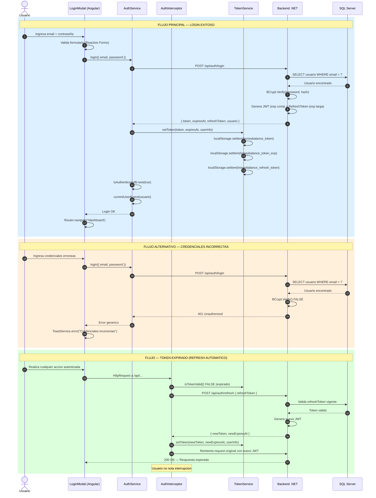

---

## DIAGRAMA 5 — Secuencia: Registrar Transacción (CU-08)

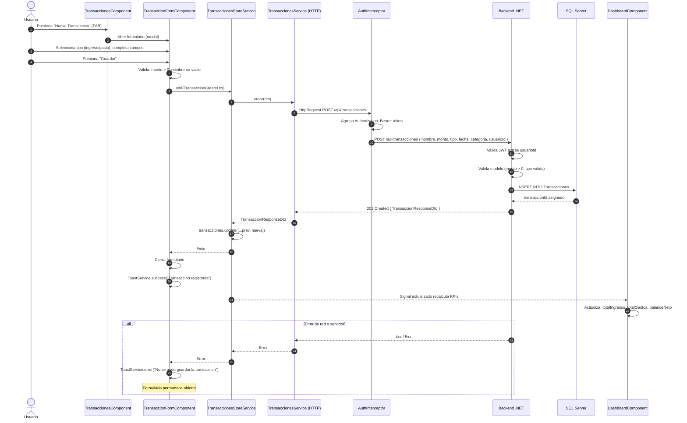

---

## DIAGRAMA 6 — Secuencia: Crear Meta de Ahorro Offline-First (CU-12)

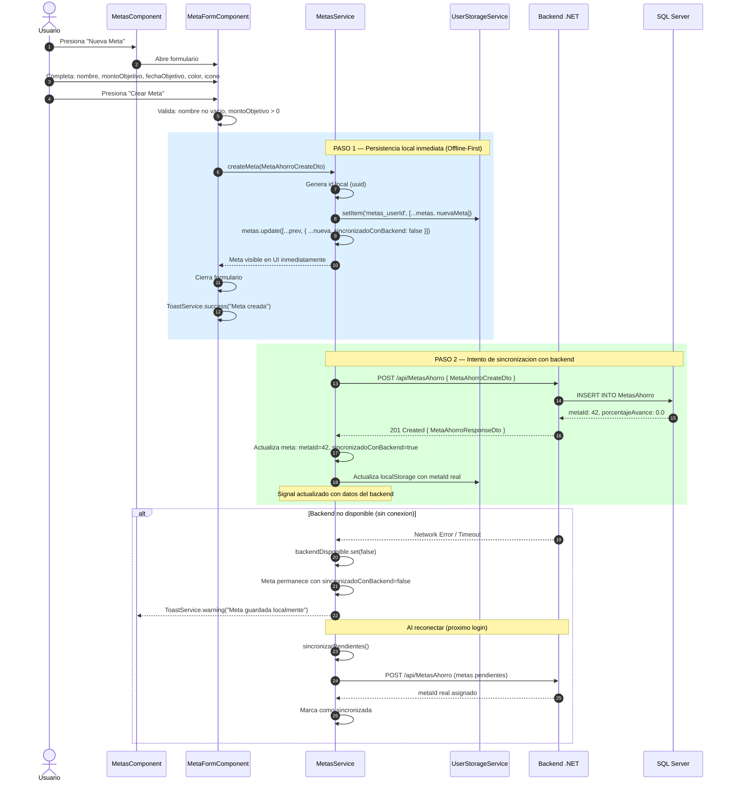

---

## DIAGRAMA 7 — Secuencia: Recuperar Contraseña (CU-04)

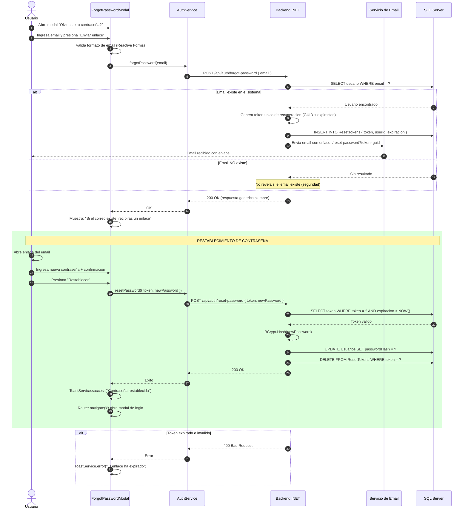

---

## DIAGRAMA 8 — Actividades: Flujo de Autenticación (Login + Guard + Refresh)

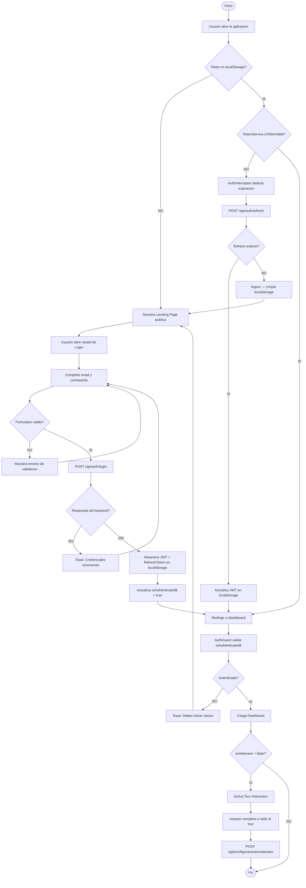

---

## DIAGRAMA 9 — Actividades: Registro de Transacción (CU-08)

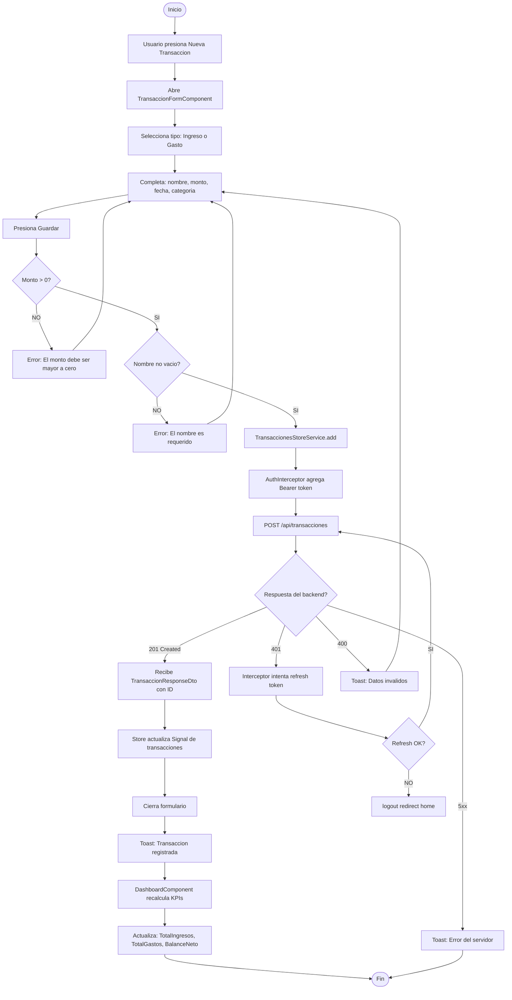

---

## DIAGRAMA 10 — Actividades: Ciclo de Vida de Meta de Ahorro (CU-12, CU-13, CU-14)

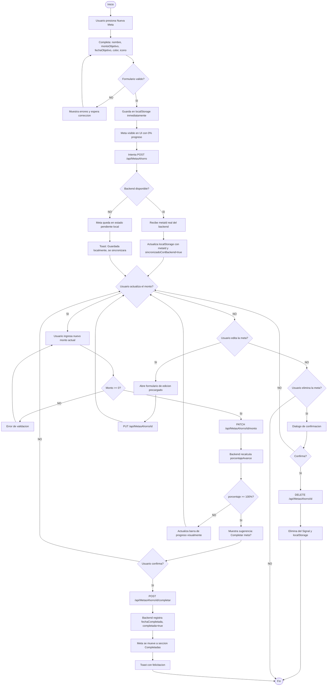

---

## DIAGRAMA 11 — Actividades: Configuración de Preferencias de Usuario (CU-18)

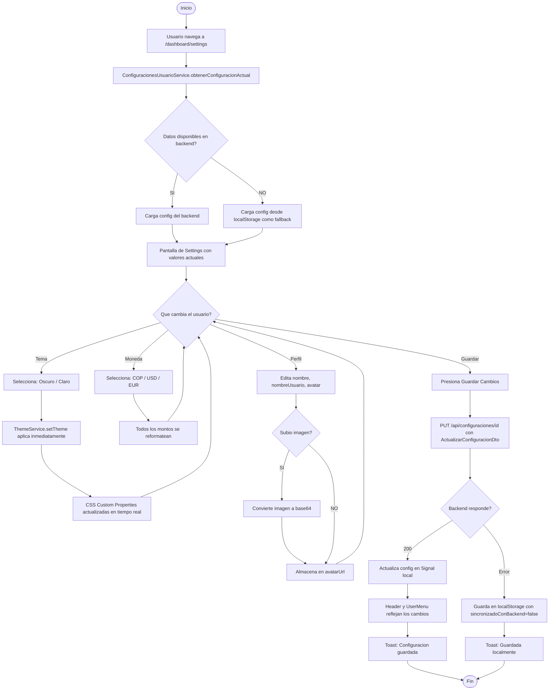

---

## DIAGRAMA 12 — Casos de Uso (Alto Nivel)

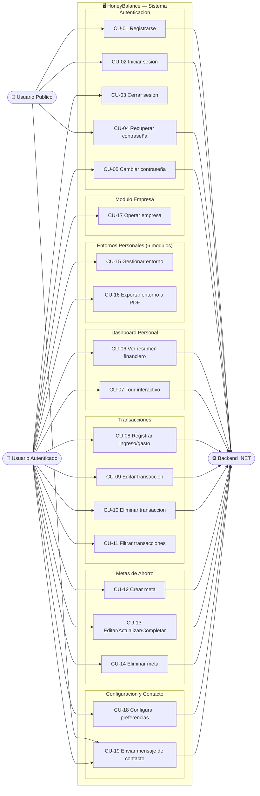

---

## DIAGRAMA 13 — Componentes: Arquitectura Modular del Frontend

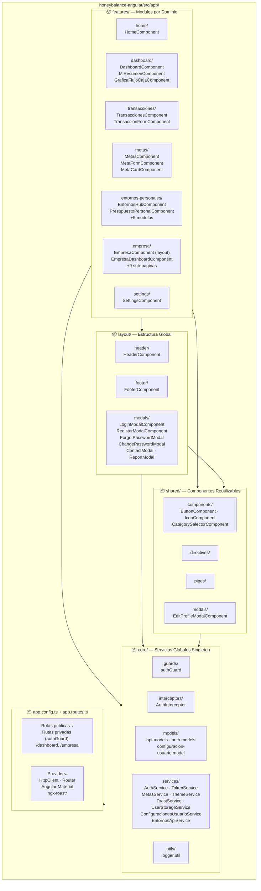

---

## DIAGRAMA 14 — Despliegue

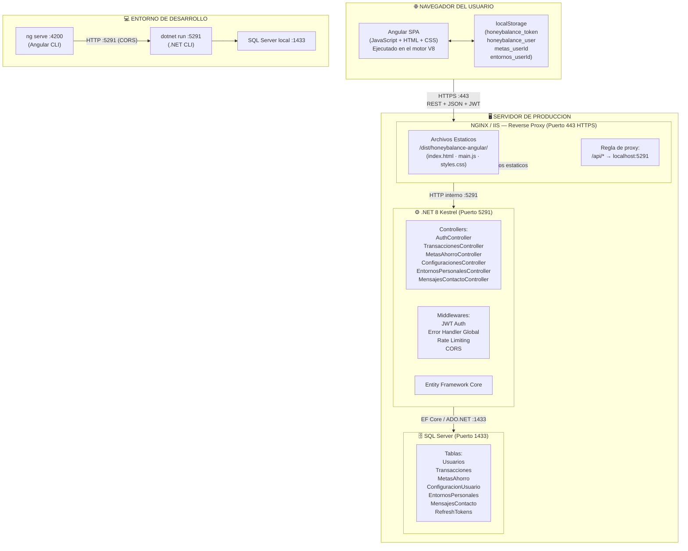

---

## DIAGRAMA 15 — Estados: MetaAhorro

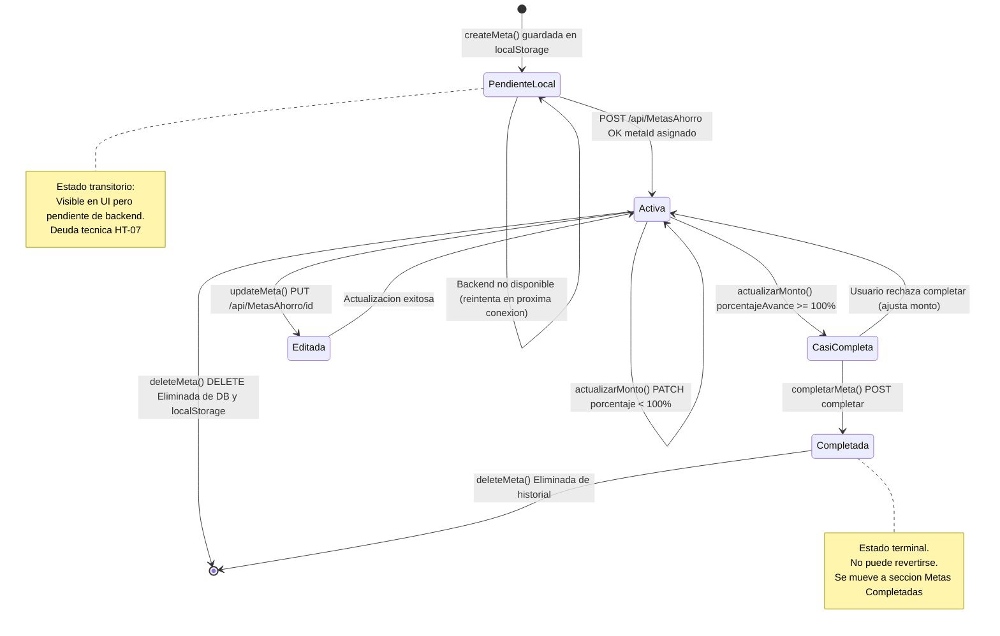

---

## DIAGRAMA 16a — Estados: Suscripción (Entorno Personal)

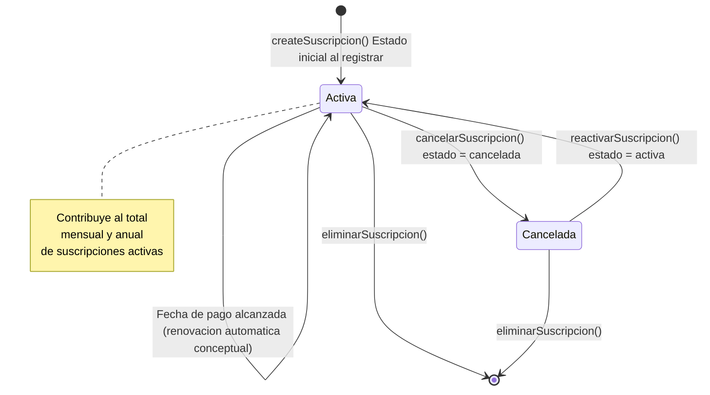

---

## DIAGRAMA 16b — Estados: Sincronización de Datos (Patrón Offline-First)

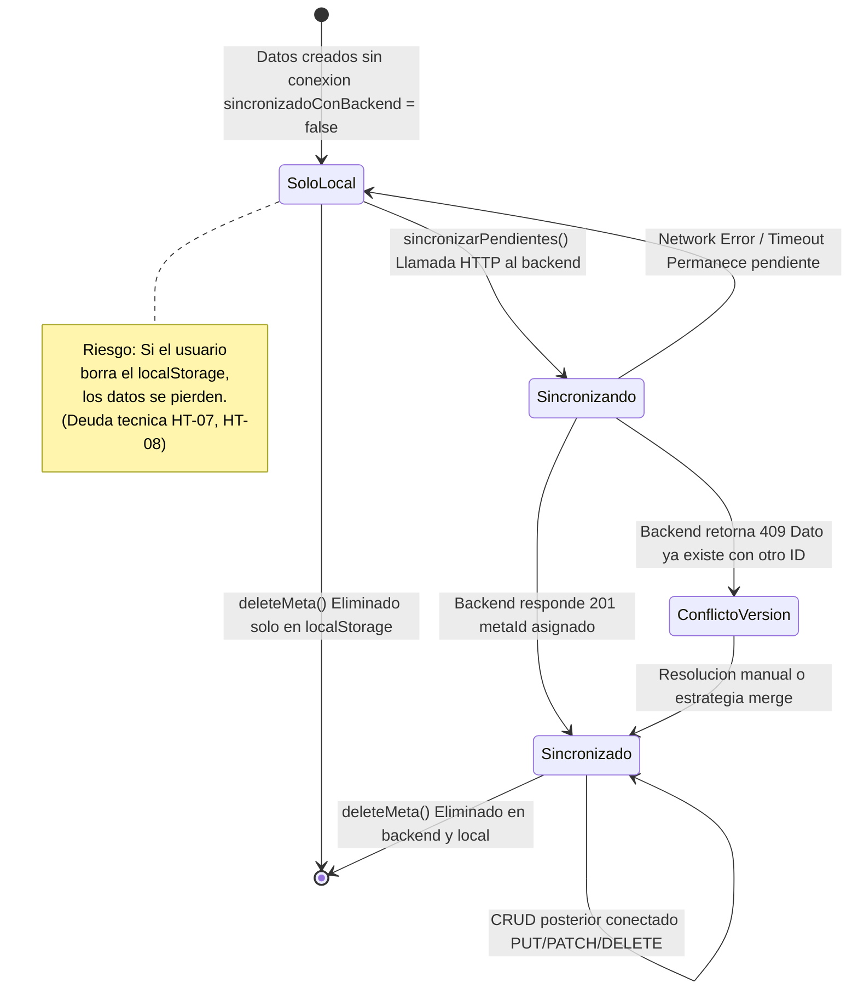

---

## INSTRUCCIONES DE USO

1. **Mermaid Live Editor (Recomendado):**
   - Ir a https://mermaid.live
   - Copiar el código de cada diagrama (SIN las líneas ` ```mermaid ` y ` ``` `)
   - Pegar en el panel izquierdo
   - El diagrama se renderiza al instante en el panel derecho
   - Clic en "Actions" → "PNG" o "SVG" para exportar

2. **VS Code:**
   - Instalar extensión "Markdown Preview Mermaid Support"
   - Abrir este archivo .md
   - Ctrl + Shift + V para previsualizar

3. **GitHub / GitLab:**
   - Subir este archivo .md al repositorio
   - Los bloques mermaid se renderizan automáticamente
